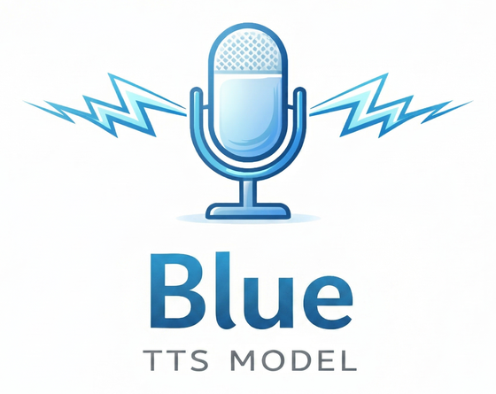

<p align="center">
  
</p>

<h1 align="center">BlueTTS</h1>

<p align="center">Multilingual text-to-speech on ONNX Runtime — Hebrew, English, Spanish, Italian, German.</p>

<p align="center">
  <a href="https://pypi.org/project/blue-onnx/"></a>
  &nbsp;
  <a href="https://huggingface.co/spaces/notmax123/BlueV2"></a>
  &nbsp;
  <a href="https://lightbluetts.com/"></a>
</p>

---

## Quick start

```bash
git clone https://github.com/maxmelichov/BlueTTS.git
cd BlueTTS
uv sync
uv run hf download notmax123/blue-onnx-v2 --repo-type model --local-dir ./onnx_models
```

Voice JSONs ship in [`voices/`](voices/), so you are ready to synthesize:

```python
import soundfile as sf
from blue_onnx import BlueTTS

tts = BlueTTS(onnx_dir="onnx_models", style_json="voices/noa.json")
samples, sr = tts.synthesize("שלום, זהו מודל דיבור בעברית.", lang="he")
sf.write("out.wav", samples, sr)
```

Numbers, dates, prices and codes are spoken as words automatically. Mix languages
inline with `<en>…</en>`:

```python
samples, sr = tts.synthesize("שלום לכולם, <en>welcome to the presentation</en>.", lang="he")
```

Hebrew grapheme-to-phoneme is handled by [RenikudPlus](https://github.com/maxmelichov/RenikudPlus),
which downloads its own weights the first time you synthesize Hebrew.

## Documentation

| | |
|---|---|
| [`src/blue_onnx/`](src/blue_onnx/README.md) | **Inference API** — entry points, text normalization, language spans, accelerators |
| [`examples/`](examples/README.md) | Runnable scripts for every feature |
| [`exports/`](exports/README.md) | New voices, ONNX export, TensorRT engines |
| [`training/`](training/README.md) | Dataset prep and the three training stages |

## Install

Requires **Python 3.12+** and [uv](https://docs.astral.sh/uv/).

```bash
git clone https://github.com/maxmelichov/BlueTTS.git
cd BlueTTS
uv sync
```

Optional extras are documented per use case: [accelerators](src/blue_onnx/README.md#accelerators)
(OpenVINO, CUDA), [`--extra export`](exports/README.md) for voice/ONNX export, and
[`--extra tensorrt`](exports/README.md#build-tensorrt-engines).

## Models

**FP32 (recommended)** — [notmax123/blue-onnx-v2](https://huggingface.co/notmax123/blue-onnx-v2).
onnxslim-cleaned, full precision. Ships the four core graphs (`text_encoder`,
`vector_estimator`, `vocoder`, `duration_predictor`), the runtime `tts.json` / `vocab.json`,
and the graphs for zero-shot voice conversion from a reference clip.

```bash
uv run hf download notmax123/blue-onnx-v2 --repo-type model --local-dir ./onnx_models
```

**INT8 (experimental)** — [notmax123/bluev2-onnx-int8](https://huggingface.co/notmax123/bluev2-onnx-int8).
Weight-only quantized, smaller footprint, not slimmed. Same filenames and layout; point
`onnx_dir` at it. Prefer FP32 for quality.

Neither bundle includes per-voice **style JSON** — use [`voices/*.json`](voices/) from this
repo, or [export your own](exports/README.md#export-a-new-voice) from a reference clip
(needs the PyTorch checkpoints at [notmax123/blue-v2](https://huggingface.co/notmax123/blue-v2)).

## Citations

```bibtex
@ARTICLE{2025arXiv250323108K,
       author = {{Kim}, Hyeongju and {Yang}, Jinhyeok and {Yu}, Yechan and {Ji}, Seunghun and {Morton}, Jacob and {Bous}, Frederik and {Byun}, Joon and {Lee}, Juheon},
        title = "{SupertonicTTS: Towards Highly Efficient and Streamlined Text-to-Speech System}",
      journal = {arXiv e-prints},
     keywords = {Audio and Speech Processing, Machine Learning, Sound},
        pages = {arXiv:2503.23108},
}
@article{kim2025training,
  title={Training Flow Matching Models with Reliable Labels via Self-Purification},
  author={Kim, Hyeongju and Yu, Yechan and Yi, June Young and Lee, Juheon},
  journal={arXiv preprint arXiv:2509.19091},
  year={2025}
}
@misc{yi2025robustttstrainingselfpurifying,
      title={Robust TTS Training via Self-Purifying Flow Matching for the WildSpoof 2026 TTS Track},
      author={June Young Yi and Hyeongju Kim and Juheon Lee},
      year={2025},
      eprint={2512.17293},
      archivePrefix={arXiv},
      primaryClass={cs.SD},
      url={https://arxiv.org/abs/2512.17293},
}
```

## License

MIT.

## Voice cloning and responsibility

This software can produce speech that mimics a reference voice. **The maintainers and
contributors are not responsible** for what you do with it — compliance with law, consent
from voice owners, and ethical use are **entirely your responsibility**. Do not use it to
deceive, impersonate without permission, or infringe anyone's rights.
